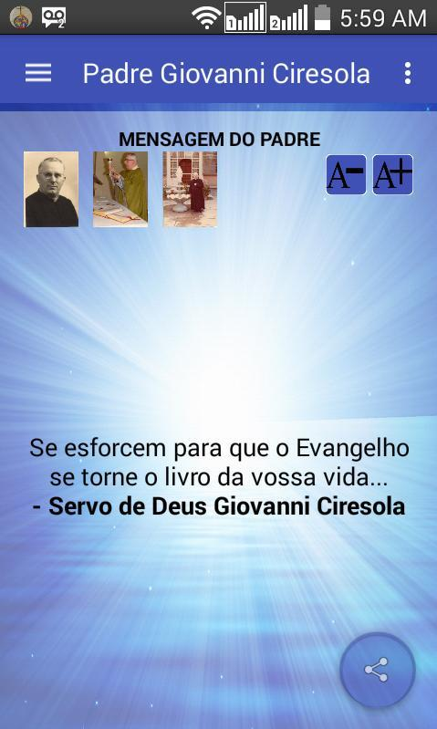
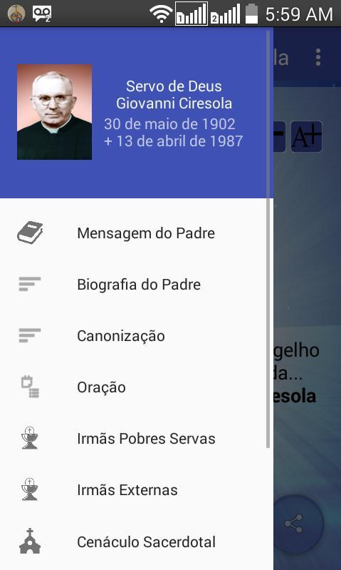
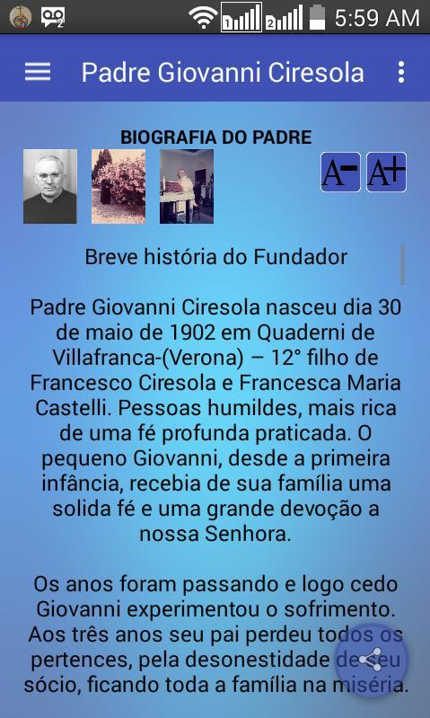
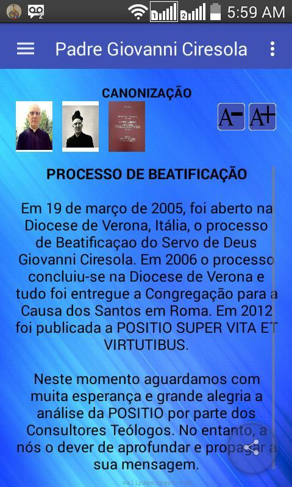
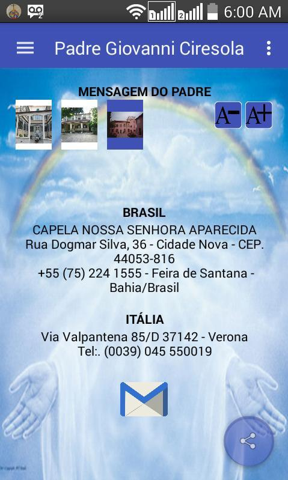
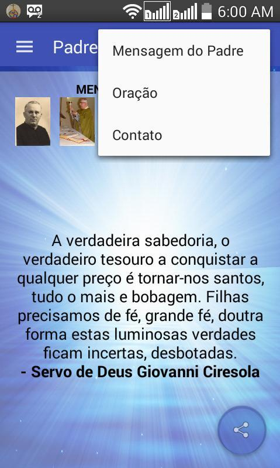
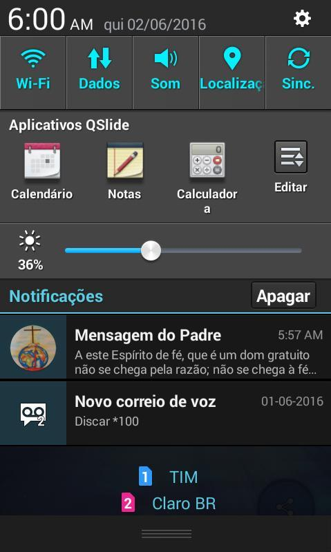

# public-Veneravel-Giovanni-Ciresola-app-android

PROJETO ANDROID (Arquivos e Códigos):

Status: Em produção;

Ano de publicação: 2016;

Android: 4.4+;

Última versão: 3.8;

Identificação: com.venerabileciresola.appandroid

Link de acesso:

https://play.google.com/store/apps/details?id=com.venerabileciresola.appandroid

https://apkpure.com/venerable-giovanni-ciresola/com.venerabileciresola.appandroid

Descrição:

O aplicativo Padre Giovanni Ciresola é a ferramenta de apresentação e divulgação da história, conselhos e projetos semeados por esse exemplar Servo de Deus.

Foi desenvolvida pelas Pobres Servas do Preciosissimo Sangue com o objetivo de fazer com que você conheça o Servo de Deus Padre Giovanni Ciresola e sua obra.

São inúmeros recursos disponibilizados pensando na simplicidade, dinamismo e informação, dentre eles, apresentação de:

*Mensagens do Padre;

*Imagens;

*Vídeos

*Sua Biografia;

*Quem são as Irmãs Pobres Servas;

*Quem são as Irmãs Externas;

*O que é o Cenáculo Sacerdotal Diocesano;

*Quem são os Amigos do Cenáculo;

Feito com muito carinho, pesquisa, dedicação e colaboração, é um aplicativo planejado para ser parte de você.

Conheça mais...

Motive-se...

Comunique-se...

Colabore com a beatificação e canonização do Servo de Deus Padre Giovanni Ciresola...